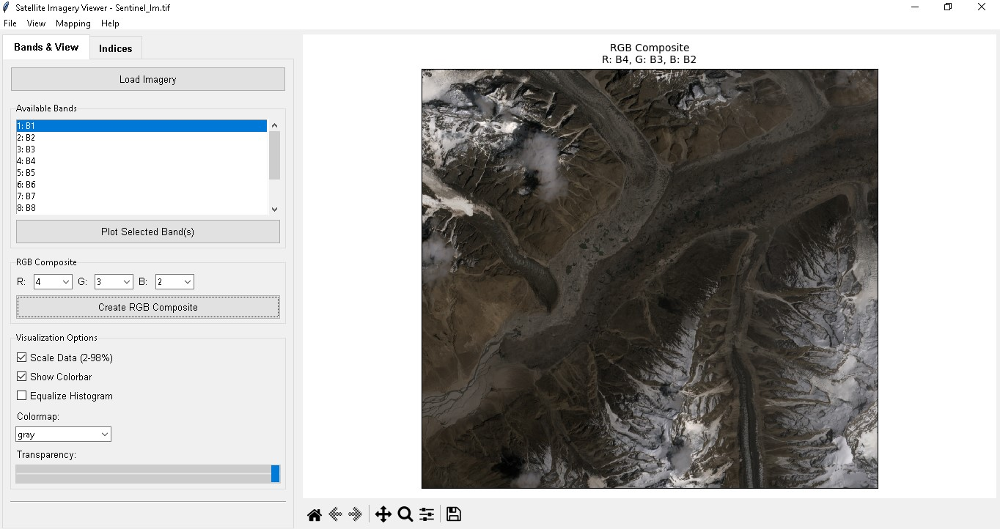
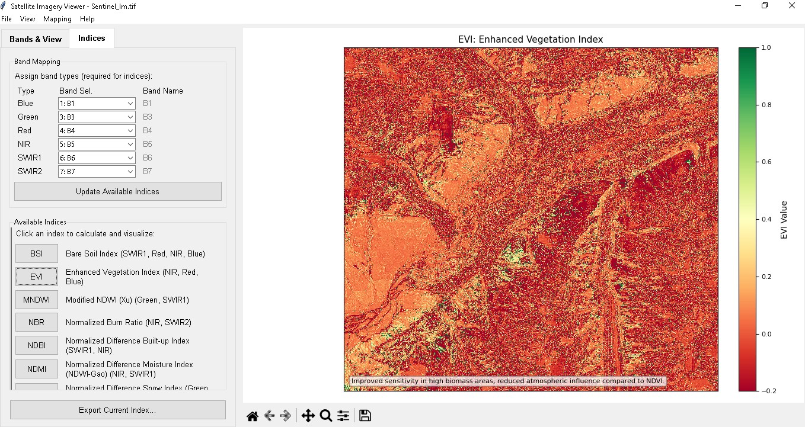

# Satellite Explorer


*Satellite Explorer - Advanced Satellite Imagery Analysis Tool*

## Overview
Satellite Explorer is a robust Python-based desktop application designed for satellite imagery analysis and visualization. It provides researchers, environmental scientists, and GIS professionals with tools to process multi-spectral satellite data and calculate various spectral indices.

## Interface

*Main interface showing band visualization and spectral indices calculation*

## Key Features

### Imagery Visualization
- Multi-band satellite imagery loading and display
- Dynamic RGB composite creation
- Band-specific contrast enhancement
- Interactive zoom and pan capabilities
- Customizable color maps and scaling options

### Spectral Analysis
- Automated band type detection
- Support for common spectral indices:
  - NDVI (Normalized Difference Vegetation Index)
  - NDWI (Normalized Difference Water Index)
  - MNDWI (Modified NDWI)
  - NDBI (Normalized Difference Built-up Index)
  - SAVI (Soil Adjusted Vegetation Index)
  - EVI (Enhanced Vegetation Index)
- Custom index formula creation
- Batch processing capabilities

### Data Management
- Save/Load band mapping configurations
- Export calculated indices as GeoTIFF
- Screenshot and visualization export
- Session persistence

## Installation

### Prerequisites
- Python 3.8 or higher
- Git (for cloning the repository)

### Setup
```bash
# Clone the repository
git clone https://github.com/yourusername/satellite-explorer.git

# Navigate to project directory
cd satellite-explorer

# Install dependencies
pip install -r requirements.txt
```

### Dependencies
```text
numpy>=1.21.0
matplotlib>=3.4.0
rasterio>=1.2.0
earthpy>=0.9.4
scikit-image>=0.18.0
tkinter (included with Python)
```

## Usage

### Starting the Application
```bash
python main.py
```

### Basic Workflow
1. **Load Data**: Use File → Load Imagery to import satellite data
2. **View Bands**: Switch between bands in the "Bands & View" tab
3. **Calculate Indices**: Use the "Indices" tab to:
   - Verify band mapping
   - Select desired indices
   - Generate visualizations
4. **Export Results**: Save calculated indices or visualizations

### Advanced Features
- Custom band mapping for non-standard satellite data
- Batch processing multiple images
- Custom index formula creation
- View configuration persistence

## Project Structure
```
satellite-explorer/
├── src/
│   ├── main.py           # Application entry point
│   ├── gui/              # GUI components
│   │   ├── app.py        # Main application window
│   │   ├── control_panel.py
│   │   ├── indices_panel.py
│   │   └── plot_panel.py
│   └── utils/            # Utility functions
│       ├── imagery.py    # Image processing
│       ├── indices.py    # Index calculations
│       └── visualization.py
├── images/               # Application screenshots
├── tests/                # Unit tests
├── docs/                 # Documentation
├── requirements.txt      # Project dependencies
└── README.md            # This file
```

## Development

### Setting Up Development Environment
```bash
# Create virtual environment
python -m venv venv

# Activate virtual environment (Windows)
.\venv\Scripts\activate

# Install development dependencies
pip install -r requirements-dev.txt
```

### Running Tests
```bash
pytest tests/
```

### Contributing
1. Fork the repository
2. Create a feature branch (`git checkout -b feature/AmazingFeature`)
3. Commit changes (`git commit -m 'Add AmazingFeature'`)
4. Push to branch (`git push origin feature/AmazingFeature`)
5. Open a Pull Request

## License
This project is licensed under the MIT License - see the [LICENSE](LICENSE) file for details.

## Contact
Your Name - [@Hanzila Bin Younas](https://www.linkedin.com/in/hanzila-bin-younas-609263293)
Project Link: [https://github.com/hanzila1/satellite-explorer](https://github.com/yourusername/satellite-explorer)

## Acknowledgments
- NumPy community for numerical computing support
- Matplotlib team for visualization capabilities
- Rasterio developers for geospatial data handling